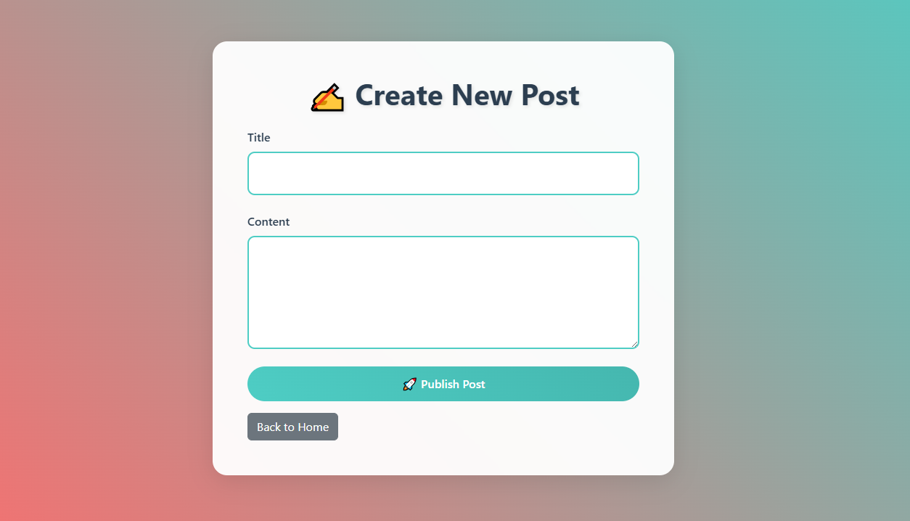

# 🌀 Funky Blog Hub 🎨✨

Welcome to **Funky Blog Hub** – the ultimate platform for creative thinkers and bold storytellers! 🚀 This isn't just another blog – it's an engaging, dynamic space where ideas flow, visuals captivate, and innovation thrives.

## 🌟 Features

✅ **Unique Design** – A bold, colorful, and distinctive aesthetic.  
✅ **Streamlined Blogging** – Write, edit, and publish seamlessly.  
✅ **Interactive Elements** – Enable comments, reactions, and social sharing.  
✅ **Customizable Interface** – Modify themes, fonts, and layouts to suit your style.  
✅ **Responsive Design** – Optimized for all screen sizes and devices.

## 🚀 Getting Started

1. **Clone the Repository**:  
   ```bash
   git clone https://github.com/yourusername/funky-blog-hub.git
   ```
2. **Navigate to the Project Directory**:  
   ```bash
   cd funky-blog-hub
   ```
3. **Install Dependencies** (if required):  
   ```bash
   npm install
   ```
4. **Start the Application**:  
   ```bash
   npm start
   ```

## 🎨 Customization

Express your creativity! Modify the colors, fonts, and layouts within the configuration files to personalize the blog's aesthetic and functionality. 💡

## 📌 Contributing

Have a new idea? Fork the repository, implement your enhancements, and submit a pull request – let’s collaboratively make this platform even more innovative! 🕺💻

## 📜 License

This project is licensed under the **MIT License** – because creative ideas are meant to be shared. 🎤

---

🎉 **Stay bold, stay creative!** 🎭

## 📸 Demo (1)

## 📸 Demo (2)

